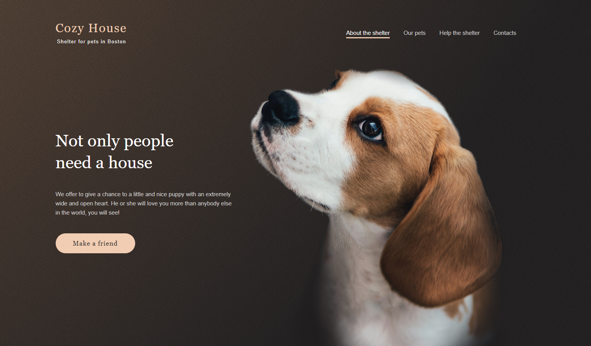

# shelter

## Описание проекта
Shelter - это сайт приюта для животных, состоящий из двух страниц, с элементами адаптивности и интерактивности.

## Этапы работы над проектом:
Задание состоит из трёх частей:
- Часть 1. Фиксированная верстка страниц `main` и `pets`.
  - в этой части задания страницы имеют фиксированную верстку. При фиксированной верстке страницы выглядят одинаково при ширине окна не менее 1280px.
- Часть 2. Добавление адаптивности верстки.
  - в этой части задания ранее созданные страницы были адаптированы согласно макету под различную ширину окна до 320px включительно.
- Часть 3. Добавление дополнительного функционала.
  - в этой части задания на ранее сверстанные страницы добавляется дополнительный функционал:
     - слайдер
     - пагинация
     - попап

<kbd></kbd>

[Макет Shelter. Figma](https://www.figma.com/file/tKcmzkARtMUFQAR9VLdLkl/shelter-dom)

---

- Вёрстка страницы `main` состоит из трёх блоков: `<header>`, `<main>`, `<footer>`
- Блок `<main>` состоит из пяти контейнеров `
`:
  - `start-bg`
  - `about`
  - `pets`
  - `help`
  - `donation`
  - 
---
- Вёрстка страницы `pets` состоит из трёх блоков: `<header>`, `<main>`, `<footer>`
- Блок `<main>` состоит из одного контейнера `
`:
  - `pets`
---
  
[Деплой проекта](https://zixail28.github.io/shelter/pages/main/)
